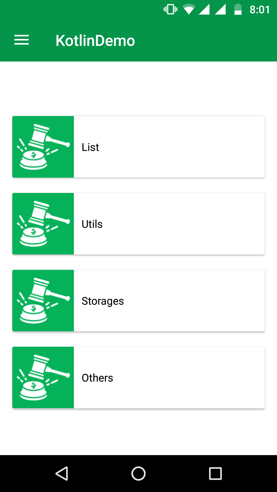
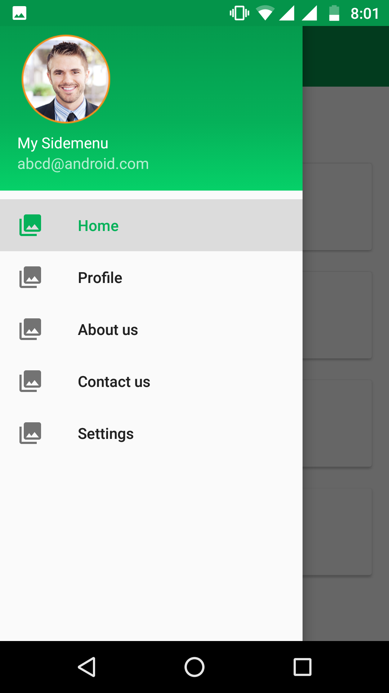
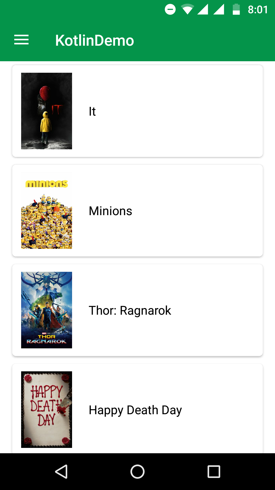
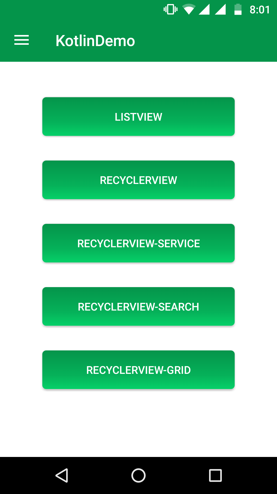
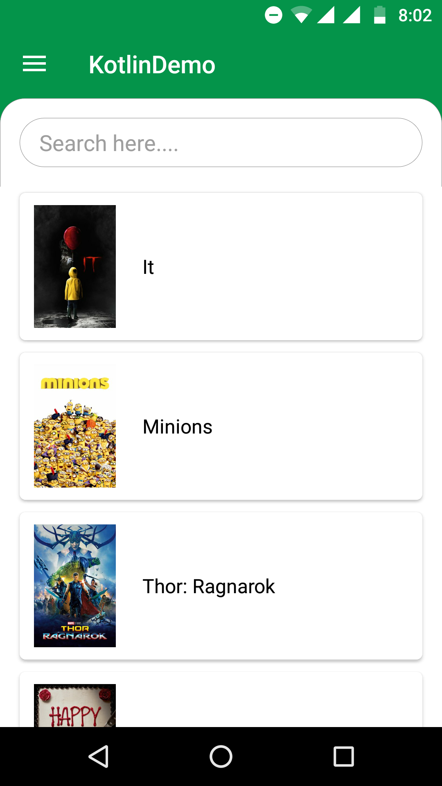

# Kotlin-Samples
Kotlin Code Sample

1. TextView

2. Button 
3. Layout
4. Click Events
5. ListView
6. RecyclerView
7. RecyclerView with search implementation
8. Recyclerview - GridLAyoutManager, LinearLAyoutManager
9. Volley Network service
10. Shared Preferences
11. Custom Dialogs
12. NavigationDrawer
13. Intent
14. Activity
15. Fragments
16. WebView
17. Save image in to sdcard
18. Qrcode and Barcode Scanning using Zxing Library

Screenshots

